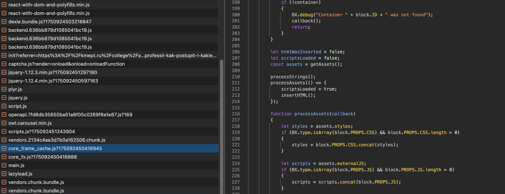
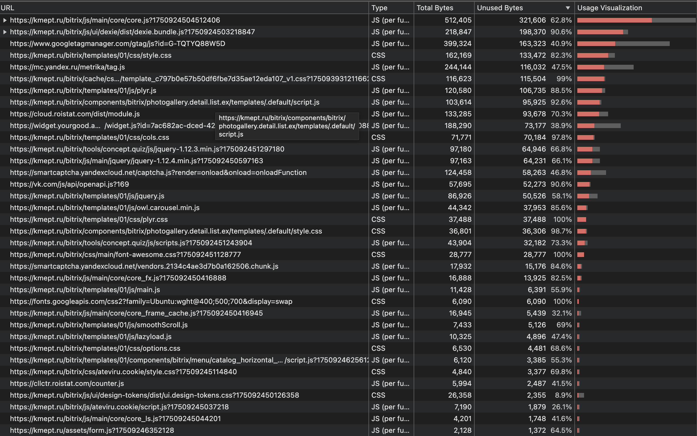

<h1>Network</h1>
<h2>Дублирование ресурсов</h2>

При проверке на дублирование смотрю на содержимое, объем ресурса после распаковки и сколько данных было передано по сети.

<ul>
    <li>
        captchapgrd - ресурс типа script загружается дважды
        
    </li>
    <li>
         advanced.4fdec4f0c66230612adf.js - ресурс типа script загружен трижды
        
    </li>
    <li>
        watch.js - ресурс типа script загружается трижды - причем первый раз по сети передается сжатый файл с большим размером, чем в остальных случаях, содержимое файлов и размер после распаковки идентичны для всех экземпляров
        
    </li>
    <li>
         react-with-dom-and-polyfills.min.js - ресурс типа script загружен трижды
        
    </li>
     <li>
        backend.636bb879d1085041bc19.js - ресурс типа script загружен трижды
       
   </li>
    <li>
        ресурс типа document загружен трижды
       
   </li>
    <li>
        шестикратно загружен bundle
        
    </li>
    <li>
        трижды загружен document
        
    </li>
</ul>

<h2>Лишний размер ресурса</h2>
<ul>
    <li>
        большие js или css файлы - лучшей практикой считается сведение бандлов до 200-300 кб. В этом случае лучше задуматься о code splitting
        
    </li>
    <li>
        тяжелые изображения: обычно стремятся к 100–200 кб, в этом случае следует задуматься о применении lazy loading и сжатии
        
    </li>
    <li>
        не оптимальный формат изображений png вместо webp, впрочем в данном случае не критично, изображение не слишком тяжелое
        
    </li>
    <li>
        все css файлы не минифицированы, в целом не критично, каждый из них не превышает 50кб
    </li>
    <li>
        ряд не минифицированных js, тоже не критично, имеют не большой размер
        
        
    </li>
</ul>
<h2>Медленно загружающиеся ресурсы</h2>
<ul>
    <li>
        На изображении видно, что самые долго загружающиеся ресурсы - изображения, возможно поможет сжатие, в случае со скриптами, можно отложить загрузку тяжелых скриптов - Async/Defer, code-splitting
        
    </li>
</ul>
<h2>Ресурсы, блокирующие загрузку</h2>
<ul>
    <li>
        
    </li>
</ul>

<h1>Performance</h1>
<ul>
    <li>
        <h2>время в миллисекундах от начала навигации до события First Contentful Paint (FCP) = 502,06ms</h2>
        
    </li>
    <li>
        <h2>время в миллисекундах от начала навигации до события Largest Contentful Paint (LCP) = 502,06ms</h2>
        
    </li>
    <li>
        <h2>время в миллисекундах от начала навигации до события DOM Content Loaded (DCL) = 649,75ms</h2>
        
    </li>
    <li>
        <h2>время в миллисекундах от начала навигации до события Load (L) = 3720ms</h2>
        
    </li>
    <li>
        <h2>елемент LSP</h2>
        
    </li>
    <li>
        <h2>сколько времени в миллисекундах тратится на разные этапы обработки документа (Loading, Scripting, Rendering, Painting)</h2>
        <h2>Loading = 6ms</h2>
        <h2>Scripting = 104ms</h2>
        <h2>Rendering = 155ms</h2>
        <h2>Painting = 8ms</h2>
        
    </li>
</ul>

<h1>Coverage</h1>

<ul>
    <li>
        <h2>Вкладка Coverage</h2>
        
    </li>
    <li>
        <h2>Объем не используемого CSS = 391.6 KB</h2>
        
    </li>
    <li>
        <h2>Объем не используемого JS = 1172.7 KB</h2>
        
    </li>
</ul>
